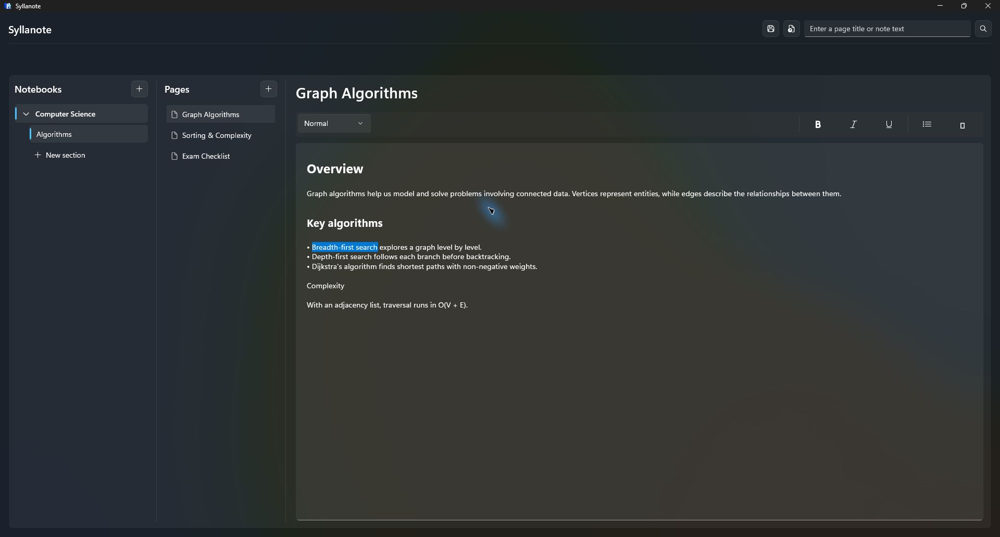
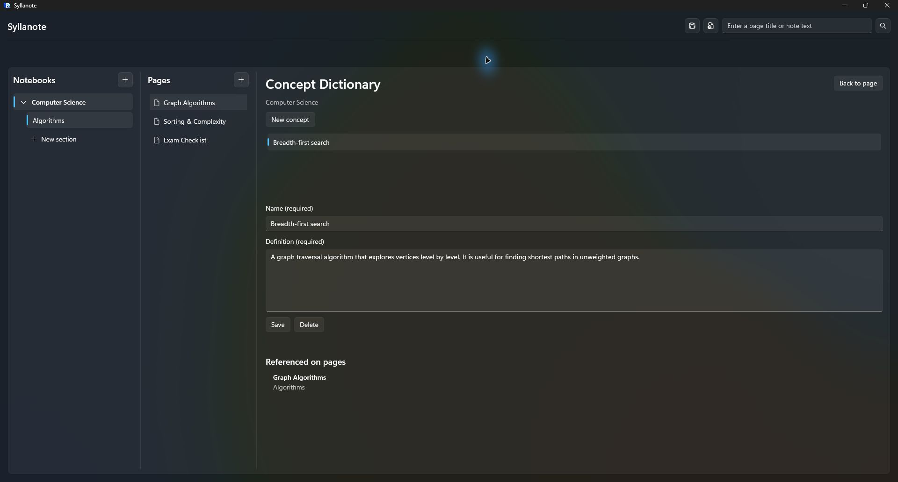

# Syllanote

Syllanote is a local-first Windows note-taking application built for students. It combines a familiar notebook structure with rich-text notes, fast search, and a notebook-specific concept dictionary that connects important terms to the pages where they are used.

> [!NOTE]
> Syllanote `v0.1.0` is the first published x64 Windows release. Download the portable ZIP and its SHA-256 checksum from the [GitHub release](https://github.com/Andershgras/syllanote/releases/tag/v0.1.0).

## Screenshots

### Notes and formatting



### Concept Dictionary



## Features

### Organize notes

- Create, rename, delete, and manually reorder notebooks, sections, and pages
- Navigate through a three-pane workspace with expandable notebooks and clear selection states
- Keep the selected page and navigation hierarchy stable while moving between notes
- Persist the order of notebooks, sections, and pages locally

### Write and format

- Edit a page title and body in a dedicated writing surface
- Autosave changes while navigating between pages
- Format paragraphs as Normal, Heading 1, or Heading 2
- Apply bold, italic, and underline formatting
- Create bulleted and numbered lists
- Preserve rich-text formatting between application sessions

Page content is stored as both Rich Text Format (RTF) and searchable plain text. This keeps formatting independent from search and concept recognition.

### Search and concepts

- Search page titles and content across all notebooks
- Start a search with `Enter` or focus search with `Ctrl+F`
- Create, update, and delete concepts within each notebook
- Recognize and highlight concepts in page content
- Open a highlighted concept to read its definition
- See which pages reference a concept and navigate directly to them

### Protect and restore data

- Create a manual whole-library backup as a `.syllanote-backup` file
- Preserve notebooks, sections, pages, rich-text content, ordering, and concepts in one versioned archive
- Validate the archive, checksum, SQLite integrity, relationships, and migration history before restore
- Require explicit confirmation before a restore can replace the current library
- Create an automatic safety backup of the current library before restore
- Keep only the three newest automatic safety backups to limit disk usage

### Desktop experience

- Resize the notebook and page panels
- Restore panel widths, window size, position, and maximized state between sessions
- Use a Windows 11-inspired interface with Mica, a themed title bar, Fluent icons, and consistent empty states

## Technology

- C# and .NET 9
- WinUI 3 and Windows App SDK
- CommunityToolkit.Mvvm
- Entity Framework Core with SQLite
- Microsoft.Extensions.DependencyInjection
- MSTest

## Architecture

The solution is separated into four application layers:

| Project | Responsibility |
| --- | --- |
| `Syllanote.Domain` | Core entities and domain rules for notebooks, sections, pages, and concepts |
| `Syllanote.Application` | Use-case services and repository abstractions |
| `Syllanote.Infrastructure` | Entity Framework Core, SQLite persistence, migrations, and repository implementations |
| `Syllanote.Desktop` | WinUI views, controls, view models, navigation, and dependency-injection composition |

The dependency direction keeps the domain independent of the user interface and persistence details:

```text
Syllanote.Desktop ───────► Syllanote.Application ───────► Syllanote.Domain
        │                           ▲
        └──► Syllanote.Infrastructure ────────────────► Syllanote.Domain
```

Automated tests live in `Syllanote.Tests` and cover domain behavior, application services, dependency registration, search, concept recognition, SQLite persistence, and backup and restore safety.

The current manual desktop checks are maintained in the [WinUI regression checklist](docs/manual-regression-checklist.md).

Installation, upgrade, uninstall, local-data, backup, restore, and troubleshooting instructions for the portable release are maintained in the [release guide](docs/release-guide.md).

The complete version mapping, highlights, verification record, and known limitations for the first release are documented in the [`v0.1.0` release notes](docs/release-notes/v0.1.0.md).

## Project structure

```text
syllanote/
├── README.md
├── LICENSE
└── Syllanote/
    ├── Syllanote.sln
    ├── src/
    │   ├── Syllanote.Domain/
    │   ├── Syllanote.Application/
    │   ├── Syllanote.Infrastructure/
    │   └── Syllanote.Desktop/
    └── tests/
        └── Syllanote.Tests/
```

## Getting started

### Requirements

- Windows 10 version 1809 or later; Windows 11 is recommended
- [.NET 9 SDK](https://dotnet.microsoft.com/download/dotnet/9.0)
- Visual Studio 2022 with the components required for WinUI 3 and Windows App SDK development

### Run the application

1. Clone the repository:

   ```powershell
   git clone https://github.com/Andershgras/syllanote.git
   cd syllanote
   ```

2. Open `Syllanote/Syllanote.sln` in Visual Studio.
3. Set `Syllanote.Desktop` as the startup project.
4. Select the `x64` platform and run the application with `F5`.

Entity Framework Core applies pending database migrations automatically when the application starts.

### Build from the command line

From the repository root:

```powershell
dotnet restore Syllanote/Syllanote.sln
dotnet build Syllanote/Syllanote.sln -c Debug
```

The desktop project is configured as `x64` by the solution when building the `Any CPU` solution configuration.

### Run the tests

```powershell
dotnet test Syllanote/tests/Syllanote.Tests/Syllanote.Tests.csproj -c Debug -m:1
```

The `-m:1` option runs the test project without parallel MSBuild workers, which gives more predictable results for its SQLite integration tests.

The current automated baseline is 160 passing tests. On 2026-10-09, restore, Debug and Release builds, and the x64 portable publish completed successfully; both builds finished with no warnings or errors.

The normal WinUI workflow, startup failure handling, autosave recovery, and manual backup and restore flow were also verified on 2026-10-01.

### Continuous integration

The Windows CI workflow runs on pushes, pull requests, and manual dispatches. It restores the solution, builds the Debug configuration, and runs the complete automated test suite with .NET 9.

### Build the portable x64 release

The committed x64 profile produces an unpackaged, self-contained release that includes both .NET and the Windows App SDK runtime. Build the versioned ZIP from the repository root:

```powershell
.\scripts\build-portable-release.ps1
```

The ZIP and its SHA-256 checksum are written to `artifacts/`. For `v0.1.0`, the files are named `Syllanote-v0.1.0-win-x64.zip` and `Syllanote-v0.1.0-win-x64.zip.sha256`.

To verify the underlying publish directly without creating the ZIP:

```powershell
dotnet publish Syllanote/src/Syllanote.Desktop/Syllanote.Desktop.csproj `
  -c Release `
  -p:Platform=x64 `
  -p:PublishProfile=win-x64 `
  -m:1
```

The published files are written to:

```text
Syllanote/src/Syllanote.Desktop/bin/x64/Release/net9.0-windows10.0.19041.0/win-x64/publish/
```

Trimming is disabled for this profile because the application uses Entity Framework Core and runtime JSON serialization. This prioritizes reliable backup, restore, search, and database behavior over a smaller first-release download.

Extract the complete ZIP before starting `Syllanote.Desktop.exe`; the application depends on the files beside the executable. The portable release stores its data under `%LOCALAPPDATA%\Andershgras\Syllanote`. This is separate from the MSIX data container, so use Syllanote backup and restore when moving notes between packaged and portable installations.

## Local data

Syllanote does not require an account or an external database. The portable release stores notes and concepts in `%LOCALAPPDATA%\Andershgras\Syllanote\syllanote.db`. MSIX installations use a separate Windows package data container.

Manual backups are stored wherever the user chooses in the Windows file picker. Syllanote does not automatically delete these files.

Before a confirmed restore, Syllanote stores a safety backup in the `SafetyBackups` directory beside the live database. This happens only as part of a restore; there is no scheduled or background backup process. At most three safety backups are retained, and older ones are removed automatically.

Restore is prepared without changing the live database. Syllanote then closes and validates the prepared database again on the next start before it replaces `syllanote.db` and applies any pending migrations. If validation fails, the live database is left unchanged.

The application also uses Windows local settings to retain interface preferences such as panel widths and window placement. Data currently remains on the Windows user profile and device where it was created.

## Current limitations

- Windows is the only supported operating system
- Notes are local to one device; cloud sync and collaboration are not implemented
- Scheduled backups, backup encryption, selective restore, import, and export are not implemented
- Desktop interactions still require manual verification because the current automated suite does not drive the WinUI interface
- The first portable release is not code-signed and does not include an installer or automatic updates

## License

Syllanote is available under the [MIT License](LICENSE).
